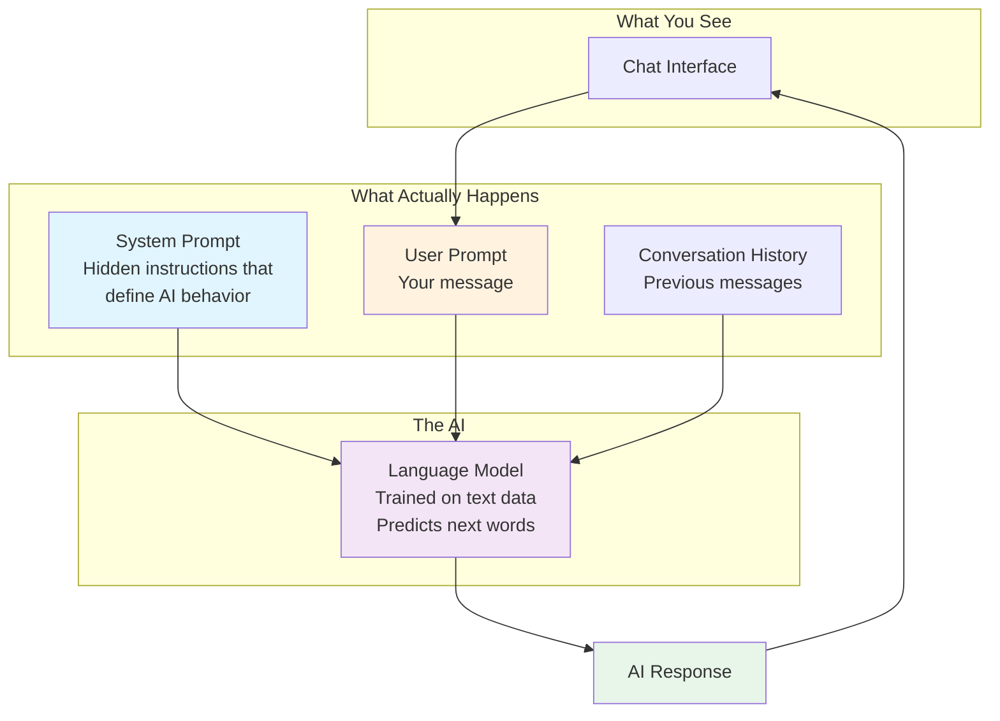

## Understanding how AI actually works

Before you can write effective prompts, you need to understand what is actually happening when you interact with AI. This is not about becoming a technical expert; it is about building the right mental model so your prompting instincts become accurate.

### The architecture of an AI conversation

When you chat with an AI assistant, there is more happening behind the scenes than you might realize. Understanding this architecture helps you write better prompts.

**The Language Model** is the AI itself, a neural network trained on vast amounts of text. Different models have different capabilities. You might have heard names like GPT-4, Claude, or Gemini. These are different models, each with their own strengths, knowledge cutoffs, and behaviors.

**The System Prompt** is a set of hidden instructions that shapes how the AI behaves. When you use ChatGPT, Claude, or other assistants, the company has already given the AI instructions about being helpful, safe, and conversational. You usually cannot see this, but it influences every response.

**The User Prompt** is what you type. This is where you have the most control, and what this course focuses on improving.

**The Conversation History** includes all previous messages in your current chat. The AI uses this context to maintain coherence, but it has limits on how much it can remember.

### Why this architecture matters for prompting

Understanding this architecture reveals several important insights:

**You are not starting from zero.** The system prompt has already shaped the AI's behavior before you type anything. This is why AI assistants are generally helpful and polite by default.

**Context accumulates.** Each message you send becomes part of the conversation history. If you give the AI a persona early in the conversation, it will (usually) maintain that persona in later messages.

**Different tools, different system prompts.** The same underlying model can behave differently depending on what system prompt it has been given. This is why Claude in one application might feel different from Claude in another.

**You can override defaults.** While you cannot change the system prompt in most chat interfaces, your user prompts can steer the AI in new directions. When you assign a persona or provide detailed context, you are essentially adding to the instructions the AI follows.

### The prediction engine

Here is the most important thing to understand: Large Language Models, or LLMs, the technology behind ChatGPT, Claude, and similar tools, do not think. They predict.

Specifically, they predict the next word. Then the next word after that. And the next. They continue predicting until they have generated an entire response.

Think of it as the world's most sophisticated autocomplete. When you start typing a text message and your phone suggests the next word, that is the same basic concept, just vastly simpler. LLMs do this at an astonishing scale and sophistication, trained on essentially all written human knowledge, but the underlying mechanism is still prediction.

This is why many experts describe working with AI as "super advanced autocomplete." It is not a thinking machine that ponders your question and formulates a thoughtful response. It is a pattern-matching engine that generates statistically likely continuations of whatever text you provide.

### A prompt is a program, not a question

This insight changes everything about how you should approach prompting.

When you type a prompt, you are not asking a question and waiting for an answer. You are providing the beginning of a text, and the AI completes it in the most statistically probable way based on everything it learned during training.

**A prompt is a program written in words.** It defines the parameters, constraints, and direction for the AI's output. The more precise your program, the more specific the output.

Consider our Japan example again:

> Plan me a trip to Japan.

From the AI's perspective, this text could be continued in millions of different ways. Someone looking for budget backpacking advice would write differently than someone planning a luxury honeymoon. Someone who loves hiking would want different recommendations than someone interested in food and culture. Someone visiting for three days has completely different needs than someone staying for three weeks.

When you give the AI no constraints, it defaults to the most generic, middle-of-the-road response because that is what would statistically satisfy the most possible users. You get a response designed for everyone, which means it is perfect for no one.

### Hacking the probability

Your job as a prompter is to hack the probability. You want to take that wide-open space of possible completions and narrow it down to the specific type of response you actually want.

Every detail you add to your prompt eliminates thousands of possible responses and makes the remaining responses more likely to match your needs.

Adding "for two weeks in April" eliminates responses about short trips and summer travel.

Adding "I'm interested in food and traditional culture" eliminates responses focused on nightlife or outdoor adventures.

Adding "budget of $3000" eliminates luxury recommendations and bare-bones hostel suggestions.

Each constraint you add is like turning dials on a machine, tuning the output toward what you actually want.

### Knowledge cutoff: AI does not know what happened yesterday

There is another crucial thing to understand: AI has a knowledge cutoff date. The model was trained on data up to a certain point, and it genuinely does not know about events, changes, or developments after that date.

If you ask about a restaurant that opened last month, the AI has no idea it exists. If you ask about current pricing or scheduling, the AI is guessing based on patterns, not facts. If you ask about recent news events, the AI either cannot answer or will make things up, which is called hallucination.

Some AI tools now have web search capabilities that can access current information, but the core model itself is frozen in time. Always be aware of this limitation, especially when your question involves current or time-sensitive information.

### The pattern completion mental model

Here is a useful way to think about every interaction with AI:

You are not asking a question. You are starting a pattern that the AI will complete.

> Plan me a trip to Japan.

This starts a pattern that could be completed by any generic travel advice.

> You are an experienced Japan travel consultant helping a first-time visitor. I'm planning a two-week trip to Japan in April with a budget of $3000. I love traditional culture, temples, and amazing food, but I'm not interested in hiking or nightlife. Help me plan an itinerary.

This starts a pattern that can only be completed by specific, personalized travel advice from an expert perspective.

Same AI. Completely different results. The only difference is how you started the pattern.

### Exercise: Experiment with specificity

Take a simple prompt and try multiple versions with different levels of detail:

**Version 1:** A vague, open-ended prompt (like our Japan example)

**Version 2:** The same prompt with one or two added details

**Version 3:** The same prompt with five or six added details

Compare the responses. Notice how each added detail changes the output. You are beginning to see how prompting actually works.
