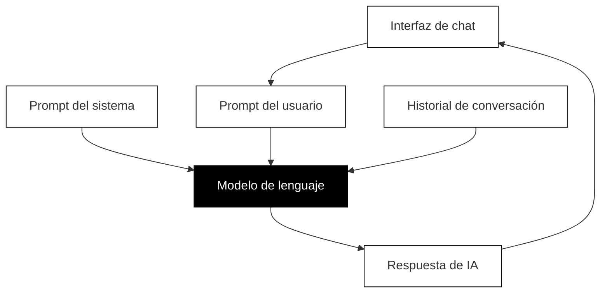

## Comprender cómo funciona realmente la IA

Antes de poder escribir prompts efectivos, necesitas entender qué está sucediendo realmente cuando interactúas con IA. No se trata de convertirse en un experto técnico, sino de construir el modelo mental correcto para que tus instintos de prompting se vuelvan precisos.

### La arquitectura de una conversación de IA

Cuando chateas con un asistente de IA, está sucediendo más detrás de escena de lo que podrías imaginar. Comprender esta arquitectura te ayuda a escribir mejores prompts.



El diagrama anterior muestra cómo las diferentes piezas trabajan juntas cuando chateas con IA:

**El modelo de lenguaje** es la IA en sí misma, una red neuronal entrenada con vastas cantidades de texto. Diferentes modelos tienen diferentes capacidades. Puede que hayas escuchado nombres como GPT-4, Claude o Gemini. Estos son modelos diferentes, cada uno con sus propias fortalezas, fechas límite de conocimiento y comportamientos.

**El prompt del sistema** es un conjunto de instrucciones ocultas que moldean cómo se comporta la IA. Cuando usas ChatGPT, Claude u otros asistentes, la compañía ya le ha dado instrucciones a la IA sobre ser útil, segura y conversacional. Por lo general no puedes ver esto, pero influye en cada respuesta.

**El prompt del usuario** es lo que tú escribes. Aquí es donde tienes el mayor control, y en lo que este curso se centra para mejorar.

**El historial de conversación** incluye todos los mensajes anteriores en tu chat actual. La IA usa este contexto para mantener coherencia, pero tiene límites sobre cuánto puede recordar.

### Por qué esta arquitectura importa para el prompting

Comprender esta arquitectura revela varias ideas importantes:

**No estás empezando desde cero.** El prompt del sistema ya ha moldeado el comportamiento de la IA antes de que escribas nada. Por esto los asistentes de IA son generalmente útiles y educados por defecto.

**El contexto se acumula.** Cada mensaje que envías se convierte en parte del historial de conversación. Si le das a la IA una personalidad temprano en la conversación, (usualmente) mantendrá esa personalidad en mensajes posteriores.

**Diferentes herramientas, diferentes prompts del sistema.** El mismo modelo subyacente puede comportarse de manera diferente dependiendo de qué prompt del sistema se le haya dado. Por esto Claude en una aplicación puede sentirse diferente de Claude en otra.

**Puedes anular los valores predeterminados.** Aunque no puedes cambiar el prompt del sistema en la mayoría de las interfaces de chat, tus prompts de usuario pueden dirigir la IA en nuevas direcciones. Cuando asignas una personalidad o proporcionas contexto detallado, esencialmente estás agregando a las instrucciones que la IA sigue.

### El motor de predicción

Aquí está lo más importante de entender: los grandes modelos de lenguaje, o LLM (Large Language Models), la tecnología detrás de ChatGPT, Claude y herramientas similares, no piensan. Predicen.

Específicamente, predicen la siguiente palabra. Luego la siguiente palabra después de esa. Y la siguiente. Continúan prediciendo hasta que han generado una respuesta completa.

Piénsalo como el autocompletado más sofisticado del mundo. Cuando comienzas a escribir un mensaje de texto y tu teléfono sugiere la siguiente palabra, ese es el mismo concepto básico, solo que mucho más simple. Los LLM hacen esto a una escala y sofisticación asombrosa, entrenados en esencialmente todo el conocimiento humano escrito, pero el mecanismo subyacente sigue siendo la predicción.

Por esto muchos expertos describen trabajar con IA como "autocompletado súper avanzado". No es una máquina pensante que reflexiona sobre tu pregunta y formula una respuesta reflexiva. Es un motor de coincidencia de patrones que genera continuaciones estadísticamente probables de cualquier texto que proporciones.

### Un prompt es un programa, no una pregunta

Esta idea cambia todo sobre cómo deberías abordar el prompting.

Cuando escribes un prompt, no estás haciendo una pregunta y esperando una respuesta. Estás proporcionando el comienzo de un texto, y la IA lo completa de la manera más estadísticamente probable basándose en todo lo que aprendió durante el entrenamiento.

**Un prompt es un programa escrito en palabras.** Define los parámetros, restricciones y dirección para la salida de la IA. Cuanto más preciso sea tu programa, más específica será la salida.

Considera nuestro ejemplo de Japón nuevamente:

```
Planifícame un viaje a Japón.
```

Desde la perspectiva de la IA, este texto podría continuarse de millones de formas diferentes. Alguien buscando consejos de viaje económico escribiría de manera diferente que alguien planeando una luna de miel de lujo. Alguien que ama el senderismo querría recomendaciones diferentes a alguien interesado en comida y cultura. Alguien que visita por tres días tiene necesidades completamente diferentes a alguien que se queda tres semanas.

Cuando no le das restricciones a la IA, por defecto opta por la respuesta más genérica y promedio porque eso es lo que estadísticamente satisfaría a la mayoría de los usuarios posibles. Obtienes una respuesta diseñada para todos, lo que significa que es perfecta para nadie.

### Hackeando la probabilidad

Tu trabajo como prompteador es hackear la probabilidad. Quieres tomar ese amplio espacio de posibles completaciones y reducirlo al tipo específico de respuesta que realmente quieres.

Cada detalle que agregas a tu prompt elimina miles de respuestas posibles y hace que las respuestas restantes sean más propensas a coincidir con tus necesidades.

Agregar "durante dos semanas en abril" elimina respuestas sobre viajes cortos y viajes de verano.

Agregar "Estoy interesado en comida y cultura tradicional" elimina respuestas enfocadas en vida nocturna o aventuras al aire libre.

Agregar "presupuesto de $3000" elimina recomendaciones de lujo y sugerencias básicas de albergues.

Cada restricción que agregas es como girar diales en una máquina, ajustando la salida hacia lo que realmente quieres.

### Fecha límite de conocimiento: la IA no sabe qué pasó ayer

Hay otra cosa crucial que entender: la IA tiene una fecha límite de conocimiento. El modelo fue entrenado con datos hasta cierto punto, y genuinamente no sabe sobre eventos, cambios o desarrollos después de esa fecha.

Si preguntas sobre un restaurante que abrió el mes pasado, la IA no tiene idea de que existe. Si preguntas sobre precios u horarios actuales, la IA está adivinando basándose en patrones, no en hechos. Si preguntas sobre eventos noticiosos recientes, la IA no puede responder o inventará cosas, lo que se llama alucinación.

Algunas herramientas de IA ahora tienen capacidades de búsqueda web que pueden acceder a información actual, pero el modelo central en sí está congelado en el tiempo. Siempre sé consciente de esta limitación, especialmente cuando tu pregunta involucra información actual o sensible al tiempo.

### El modelo mental de completación de patrones

Aquí hay una forma útil de pensar sobre cada interacción con IA:

No estás haciendo una pregunta. Estás comenzando un patrón que la IA completará.

```
Planifícame un viaje a Japón.
```

Esto comienza un patrón que podría ser completado por cualquier consejo de viaje genérico.

```
Eres un consultor de viajes experimentado en Japón ayudando a un visitante por primera vez. Estoy planeando un viaje de dos semanas a Japón en abril con un presupuesto de $3000. Me encanta la cultura tradicional, los templos y la comida increíble, pero no estoy interesado en senderismo o vida nocturna. Ayúdame a planificar un itinerario.
```

Esto comienza un patrón que solo puede ser completado por consejos de viaje específicos y personalizados desde una perspectiva experta.

Misma IA. Resultados completamente diferentes. La única diferencia es cómo comenzaste el patrón.

### Ejercicio: Experimenta con la especificidad

Toma un prompt simple y prueba múltiples versiones con diferentes niveles de detalle:

**Versión 1:** Un prompt vago y abierto (como nuestro ejemplo de Japón)

**Versión 2:** El mismo prompt con uno o dos detalles agregados

**Versión 3:** El mismo prompt con cinco o seis detalles agregados

Compara las respuestas. Nota cómo cada detalle agregado cambia la salida. Estás comenzando a ver cómo funciona realmente el prompting.
