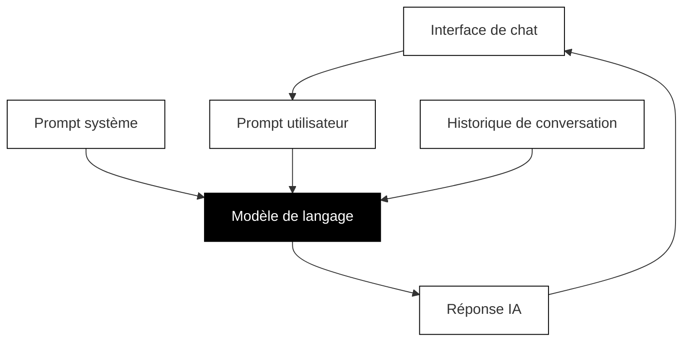

## Comprendre comment l'IA fonctionne réellement

Avant de pouvoir écrire des prompts efficaces, vous devez comprendre ce qui se passe réellement lorsque vous interagissez avec l'IA. Il ne s'agit pas de devenir un expert technique, mais de construire le bon modèle mental pour que vos instincts de prompting deviennent précis.

### L'architecture d'une conversation IA

Lorsque vous discutez avec un assistant IA, il se passe plus de choses en coulisses que vous ne le pensez. Comprendre cette architecture vous aide à écrire de meilleurs prompts.



Le diagramme ci-dessus montre comment les différentes pièces fonctionnent ensemble lorsque vous discutez avec l'IA :

**Le modèle de langage** est l'IA elle-même, un réseau neuronal entraîné sur de vastes quantités de texte. Différents modèles ont différentes capacités. Vous avez peut-être entendu des noms comme GPT-4, Claude ou Gemini. Ce sont des modèles différents, chacun avec ses propres forces, dates limite de connaissances et comportements.

**Le prompt système** est un ensemble d'instructions cachées qui façonne le comportement de l'IA. Lorsque vous utilisez ChatGPT, Claude ou d'autres assistants, l'entreprise a déjà donné à l'IA des instructions pour être utile, sûre et conversationnelle. Vous ne pouvez généralement pas voir cela, mais cela influence chaque réponse.

**Le prompt utilisateur** est ce que vous tapez. C'est là que vous avez le plus de contrôle, et c'est ce sur quoi ce cours se concentre pour s'améliorer.

**L'historique de conversation** comprend tous les messages précédents dans votre chat actuel. L'IA utilise ce contexte pour maintenir la cohérence, mais elle a des limites sur ce qu'elle peut se rappeler.

### Pourquoi cette architecture est importante pour le prompting

Comprendre cette architecture révèle plusieurs idées importantes :

**Vous ne partez pas de zéro.** Le prompt système a déjà façonné le comportement de l'IA avant que vous ne tapiez quoi que ce soit. C'est pourquoi les assistants IA sont généralement utiles et polis par défaut.

**Le contexte s'accumule.** Chaque message que vous envoyez devient partie de l'historique de conversation. Si vous donnez à l'IA un persona tôt dans la conversation, elle (généralement) maintiendra ce persona dans les messages ultérieurs.

**Différents outils, différents prompts système.** Le même modèle sous-jacent peut se comporter différemment selon le prompt système qui lui a été donné. C'est pourquoi Claude dans une application peut sembler différent de Claude dans une autre.

**Vous pouvez contourner les valeurs par défaut.** Bien que vous ne puissiez pas changer le prompt système dans la plupart des interfaces de chat, vos prompts utilisateur peuvent diriger l'IA dans de nouvelles directions. Lorsque vous attribuez un persona ou fournissez un contexte détaillé, vous ajoutez essentiellement aux instructions que l'IA suit.

### Le moteur de prédiction

Voici la chose la plus importante à comprendre : les grands modèles de langage, ou LLM (Large Language Models), la technologie derrière ChatGPT, Claude et des outils similaires, ne pensent pas. Ils prédisent.

Plus précisément, ils prédisent le mot suivant. Puis le mot suivant après cela. Et le suivant. Ils continuent à prédire jusqu'à ce qu'ils aient généré une réponse entière.

Pensez-y comme à l'autocomplétion la plus sophistiquée du monde. Lorsque vous commencez à taper un message texte et que votre téléphone suggère le mot suivant, c'est le même concept de base, juste beaucoup plus simple. Les LLM font cela à une échelle et une sophistication étonnantes, entraînés sur essentiellement toutes les connaissances humaines écrites, mais le mécanisme sous-jacent est toujours la prédiction.

C'est pourquoi de nombreux experts décrivent le travail avec l'IA comme "l'autocomplétion super avancée". Ce n'est pas une machine pensante qui réfléchit à votre question et formule une réponse réfléchie. C'est un moteur de correspondance de modèles qui génère des continuations statistiquement probables de tout texte que vous fournissez.

### Un prompt est un programme, pas une question

Cette idée change tout sur la façon dont vous devriez aborder le prompting.

Lorsque vous tapez un prompt, vous ne posez pas une question et n'attendez pas une réponse. Vous fournissez le début d'un texte, et l'IA le complète de la manière la plus statistiquement probable en fonction de tout ce qu'elle a appris pendant l'entraînement.

**Un prompt est un programme écrit en mots.** Il définit les paramètres, les contraintes et la direction de la sortie de l'IA. Plus votre programme est précis, plus la sortie est spécifique.

Considérez à nouveau notre exemple du Japon :

```
Planifie-moi un voyage au Japon.
```

Du point de vue de l'IA, ce texte pourrait être continué de millions de façons différentes. Quelqu'un cherchant des conseils de voyage à petit budget écrirait différemment de quelqu'un planifiant une lune de miel de luxe. Quelqu'un qui aime la randonnée voudrait des recommandations différentes de quelqu'un intéressé par la nourriture et la culture. Quelqu'un visitant pour trois jours a des besoins complètement différents de quelqu'un restant trois semaines.

Lorsque vous ne donnez à l'IA aucune contrainte, elle opte par défaut pour la réponse la plus générique, la plus consensuelle, car c'est ce qui satisferait statistiquement le plus grand nombre d'utilisateurs possibles. Vous obtenez une réponse conçue pour tout le monde, ce qui signifie qu'elle est parfaite pour personne.

### Pirater la probabilité

Votre travail en tant que prompteur est de pirater la probabilité. Vous voulez prendre cet espace grand ouvert de complétions possibles et le réduire au type spécifique de réponse que vous voulez réellement.

Chaque détail que vous ajoutez à votre prompt élimine des milliers de réponses possibles et rend les réponses restantes plus susceptibles de correspondre à vos besoins.

Ajouter "pendant deux semaines en avril" élimine les réponses sur les courts voyages et les voyages d'été.

Ajouter "Je m'intéresse à la nourriture et à la culture traditionnelle" élimine les réponses axées sur la vie nocturne ou les aventures en plein air.

Ajouter "budget de 3000 $" élimine les recommandations de luxe et les suggestions d'auberges de jeunesse.

Chaque contrainte que vous ajoutez est comme tourner des cadrans sur une machine, en réglant la sortie vers ce que vous voulez réellement.

### Date limite de connaissance : l'IA ne sait pas ce qui s'est passé hier

Il y a une autre chose cruciale à comprendre : l'IA a une date limite de connaissance. Le modèle a été entraîné sur des données jusqu'à un certain point, et il ne sait vraiment rien des événements, changements ou développements après cette date.

Si vous posez des questions sur un restaurant qui a ouvert le mois dernier, l'IA n'a aucune idée qu'il existe. Si vous posez des questions sur les prix ou les horaires actuels, l'IA devine en se basant sur des modèles, pas sur des faits. Si vous posez des questions sur des événements d'actualité récents, l'IA ne peut pas répondre ou invente des choses, ce qu'on appelle une hallucination.

Certains outils IA ont maintenant des capacités de recherche web qui peuvent accéder à des informations actuelles, mais le modèle de base lui-même est figé dans le temps. Soyez toujours conscient de cette limitation, surtout lorsque votre question concerne des informations actuelles ou sensibles au temps.

### Le modèle mental de complétion de modèle

Voici une façon utile de penser à chaque interaction avec l'IA :

Vous ne posez pas une question. Vous commencez un modèle que l'IA va compléter.

```
Planifie-moi un voyage au Japon.
```

Ceci commence un modèle qui pourrait être complété par n'importe quel conseil de voyage générique.

```
Tu es un consultant de voyage expérimenté au Japon aidant un visiteur pour la première fois. Je planifie un voyage de deux semaines au Japon en avril avec un budget de 3000 $. J'aime la culture traditionnelle, les temples et la nourriture incroyable, mais je ne suis pas intéressé par la randonnée ou la vie nocturne. Aide-moi à planifier un itinéraire.
```

Ceci commence un modèle qui ne peut être complété que par des conseils de voyage spécifiques et personnalisés d'un point de vue d'expert.

Même IA. Résultats complètement différents. La seule différence est la façon dont vous avez commencé le modèle.

### Exercice : Expérimentez avec la spécificité

Prenez un prompt simple et essayez plusieurs versions avec différents niveaux de détail :

**Version 1 :** Un prompt vague et ouvert (comme notre exemple du Japon)

**Version 2 :** Le même prompt avec un ou deux détails ajoutés

**Version 3 :** Le même prompt avec cinq ou six détails ajoutés

Comparez les réponses. Remarquez comment chaque détail ajouté change la sortie. Vous commencez à voir comment le prompting fonctionne réellement.
