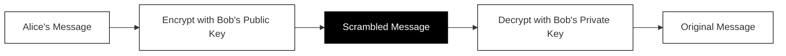

## How encryption keeps your data safe

Every time you enter a password, type a credit card number, or send a private message online, that information travels across the internet. Without protection, anyone sitting between you and the website could read everything you send. Your neighbor on the same coffee shop Wi-Fi, your internet provider, or a malicious hacker could all potentially see your data.

Encryption solves this problem. It scrambles your information so that only the intended recipient can read it.

### The Alice and Bob problem

To understand encryption, let us meet Alice and Bob. They want to exchange secret messages, but there is a problem: Eve is listening to everything they send.

If Alice sends a regular message saying "The password is sunshine123," Eve sees it too. Game over.

Alice and Bob need a way to communicate so that even if Eve intercepts every single message, she cannot understand any of them.

### The magic of public and private keys

Here is the clever solution that powers modern encryption:

Bob creates two special keys that work as a pair:

- **A public key** that Bob shares with everyone, including Alice
- **A private key** that Bob keeps completely secret

These keys have a remarkable property: anything encrypted with the public key can only be decrypted with the matching private key. Not even the public key can undo its own encryption.

This diagram shows the journey of a message: Alice writes it, encrypts it with Bob's public key, and the message becomes unreadable. Only Bob's private key can turn it back into the original.

### How the exchange works

1. Bob publishes his public key openly. Anyone can have it.
2. Alice uses Bob's public key to encrypt her message.
3. The encrypted message travels across the internet. Eve sees it, but it looks like random gibberish to her.
4. Bob receives the encrypted message and uses his private key to decrypt it.
5. Bob reads Alice's original message.

Eve can have Bob's public key. She can intercept the encrypted message. But without Bob's private key (which he never shares), she cannot read anything.

### Why this matters for you

When you visit a secure website, your browser and the website perform this same dance. They exchange keys and establish an encrypted connection. From that point forward, everything you send is scrambled before it leaves your computer and only unscrambled when it reaches the website's server.

This means:

- **Your passwords** travel safely, even on public Wi-Fi
- **Your credit card numbers** cannot be stolen in transit
- **Your private messages** stay private

Think of encryption as putting your message in an unbreakable locked box. You use the website's public key (like a special lock) to seal the box. Only the website has the private key that can open it.

### The important limitation

Encryption protects your data while it travels. It does not guarantee that the website itself is trustworthy. A scam website can still use encryption. In the next chapters, you will learn how TLS certificates help verify that you are actually talking to the website you think you are.
