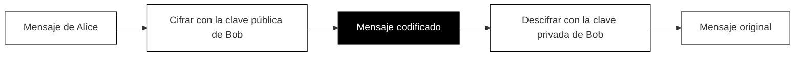

## Cómo el cifrado mantiene tus datos seguros

Cada vez que introduces una contraseña, escribes un número de tarjeta de crédito o envías un mensaje privado en línea, esa información viaja a través de internet. Sin protección, cualquiera que esté entre tú y el sitio web podría leer todo lo que envías. Tu vecino en el mismo Wi-Fi de la cafetería, tu proveedor de internet o un hacker malicioso podrían potencialmente ver tus datos.

El cifrado resuelve este problema. Codifica tu información para que solo el destinatario previsto pueda leerla.

### El problema de Alice y Bob

Para entender el cifrado, conozcamos a Alice y Bob. Quieren intercambiar mensajes secretos, pero hay un problema: Eva está escuchando todo lo que envían.

Si Alice envía un mensaje normal diciendo "La contraseña es sunshine123", Eva también lo ve. Fin del juego.

Alice y Bob necesitan una forma de comunicarse de modo que incluso si Eva intercepta cada mensaje, no pueda entender ninguno de ellos.

### La magia de las claves públicas y privadas

Esta es la solución ingeniosa que impulsa el cifrado moderno:

Bob crea dos claves especiales que funcionan como un par:

- **Una clave pública** que Bob comparte con todos, incluida Alice
- **Una clave privada** que Bob mantiene completamente en secreto

Estas claves tienen una propiedad notable: cualquier cosa cifrada con la clave pública solo puede descifrarse con la clave privada correspondiente. Ni siquiera la clave pública puede deshacer su propio cifrado.

Este diagrama muestra el recorrido de un mensaje: Alice lo escribe, lo cifra con la clave pública de Bob, y el mensaje se vuelve ilegible. Solo la clave privada de Bob puede convertirlo de nuevo en el mensaje original.

### Cómo funciona el intercambio

1. Bob publica su clave pública abiertamente. Cualquiera puede tenerla.
2. Alice usa la clave pública de Bob para cifrar su mensaje.
3. El mensaje cifrado viaja a través de internet. Eva lo ve, pero le parece un galimatías aleatorio.
4. Bob recibe el mensaje cifrado y usa su clave privada para descifrarlo.
5. Bob lee el mensaje original de Alice.

Eva puede tener la clave pública de Bob. Puede interceptar el mensaje cifrado. Pero sin la clave privada de Bob (que él nunca comparte), no puede leer nada.

### Por qué esto importa para ti

Cuando visitas un sitio web seguro, tu navegador y el sitio web realizan este mismo baile. Intercambian claves y establecen una conexión cifrada. A partir de ese momento, todo lo que envías se codifica antes de salir de tu computadora y solo se decodifica cuando llega al servidor del sitio web.

Esto significa:

- **Tus contraseñas** viajan seguras, incluso en Wi-Fi público
- **Tus números de tarjeta de crédito** no pueden ser robados en tránsito
- **Tus mensajes privados** permanecen privados

Piensa en el cifrado como poner tu mensaje en una caja cerrada e irrompible. Usas la clave pública del sitio web (como un candado especial) para sellar la caja. Solo el sitio web tiene la clave privada que puede abrirla.

### La limitación importante

El cifrado protege tus datos mientras viajan. No garantiza que el sitio web en sí sea confiable. Un sitio web fraudulento aún puede usar cifrado. En los próximos capítulos, aprenderás cómo los certificados TLS ayudan a verificar que realmente estás hablando con el sitio web que crees.
