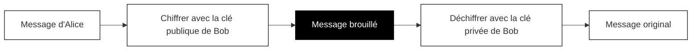

## Comment le chiffrement protège vos données

Chaque fois que vous entrez un mot de passe, saisissez un numéro de carte bancaire ou envoyez un message privé en ligne, ces informations voyagent à travers internet. Sans protection, quiconque se trouve entre vous et le site web pourrait lire tout ce que vous envoyez. Votre voisin sur le même Wi-Fi du café, votre fournisseur d'accès internet ou un pirate malveillant pourraient tous potentiellement voir vos données.

Le chiffrement résout ce problème. Il brouille vos informations de sorte que seul le destinataire prévu puisse les lire.

### Le problème d'Alice et Bob

Pour comprendre le chiffrement, faisons connaissance avec Alice et Bob. Ils veulent échanger des messages secrets, mais il y a un problème : Ève écoute tout ce qu'ils envoient.

Si Alice envoie un message normal disant « Le mot de passe est sunshine123 », Ève le voit aussi. Partie terminée.

Alice et Bob ont besoin d'un moyen de communiquer de sorte que même si Ève intercepte chaque message, elle ne puisse en comprendre aucun.

### La magie des clés publiques et privées

Voici la solution ingénieuse qui alimente le chiffrement moderne :

Bob crée deux clés spéciales qui fonctionnent en paire :

- **Une clé publique** que Bob partage avec tout le monde, y compris Alice
- **Une clé privée** que Bob garde complètement secrète

Ces clés ont une propriété remarquable : tout ce qui est chiffré avec la clé publique ne peut être déchiffré qu'avec la clé privée correspondante. Même la clé publique ne peut pas annuler son propre chiffrement.

Ce diagramme montre le parcours d'un message : Alice l'écrit, le chiffre avec la clé publique de Bob, et le message devient illisible. Seule la clé privée de Bob peut le retransformer en message original.

### Comment fonctionne l'échange

1. Bob publie sa clé publique ouvertement. Tout le monde peut l'avoir.
2. Alice utilise la clé publique de Bob pour chiffrer son message.
3. Le message chiffré voyage à travers internet. Ève le voit, mais cela ressemble à du charabia aléatoire pour elle.
4. Bob reçoit le message chiffré et utilise sa clé privée pour le déchiffrer.
5. Bob lit le message original d'Alice.

Ève peut avoir la clé publique de Bob. Elle peut intercepter le message chiffré. Mais sans la clé privée de Bob (qu'il ne partage jamais), elle ne peut rien lire.

### Pourquoi c'est important pour vous

Lorsque vous visitez un site web sécurisé, votre navigateur et le site web effectuent cette même danse. Ils échangent des clés et établissent une connexion chiffrée. À partir de ce moment, tout ce que vous envoyez est brouillé avant de quitter votre ordinateur et n'est débrouillé que lorsqu'il atteint le serveur du site web.

Cela signifie :

- **Vos mots de passe** voyagent en sécurité, même sur le Wi-Fi public
- **Vos numéros de carte bancaire** ne peuvent pas être volés en transit
- **Vos messages privés** restent privés

Pensez au chiffrement comme à mettre votre message dans une boîte verrouillée incassable. Vous utilisez la clé publique du site web (comme un cadenas spécial) pour sceller la boîte. Seul le site web possède la clé privée qui peut l'ouvrir.

### La limitation importante

Le chiffrement protège vos données pendant leur voyage. Il ne garantit pas que le site web lui-même est digne de confiance. Un site web frauduleux peut toujours utiliser le chiffrement. Dans les prochains chapitres, vous apprendrez comment les certificats TLS aident à vérifier que vous parlez réellement au site web que vous pensez.
