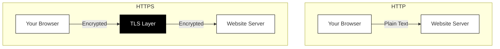

## What is HTTPS and TLS?

You have probably noticed that website addresses sometimes start with "http://" and sometimes with "https://". That single letter "s" makes an enormous difference to your security.

### HTTP: The original, unprotected web

HTTP (HyperText Transfer Protocol) is the language browsers and websites use to communicate. When you visit a website, your browser sends HTTP requests ("give me this page") and receives HTTP responses ("here is the page content").

The problem? Original HTTP sends everything as plain text. Anyone watching the network traffic can read every word.

Imagine sending a postcard through the mail. The postal workers, the sorting machines, and anyone who handles the card can read your message. That is HTTP.

### HTTPS: HTTP with a secure layer

HTTPS (HyperText Transfer Protocol Secure) wraps HTTP inside a protective layer called TLS (Transport Layer Security). Your messages still travel the same way, but now they are encrypted before leaving your device and decrypted only when they reach the destination.

If HTTP is a postcard, HTTPS is a sealed, tamper-proof envelope that only the recipient can open.

### What TLS actually does

TLS (Transport Layer Security) performs three critical jobs:

**1. Encryption**

TLS encrypts all data flowing between your browser and the website. Even if someone intercepts your traffic, they see only meaningless scrambled data.

**2. Authentication**

TLS verifies that you are actually talking to the website you requested. Without this, an attacker could pretend to be your bank and steal your login credentials. We will explore how this works in the next chapter.

**3. Integrity**

TLS ensures that data cannot be modified in transit. If anyone tries to tamper with the encrypted data, the receiving end detects it and rejects the connection.

### How your browser establishes a secure connection

When you visit an HTTPS website, a quick handshake happens behind the scenes:

1. **Your browser says hello** and lists the encryption methods it supports.
2. **The server responds** with its TLS certificate and chosen encryption method.
3. **Your browser verifies** the certificate (checking if it is valid and trustworthy).
4. **Both sides agree** on encryption keys for this session.
5. **Secure communication begins.**

This entire process takes a fraction of a second. You never notice it happening.

### The padlock icon

Modern browsers show a padlock icon (or similar indicator) when you have a secure HTTPS connection. This icon means:

- Your connection to this website is encrypted
- The website presented a valid TLS certificate
- The certificate was issued by a trusted authority

**What the padlock does NOT mean:**

- The website is legitimate or safe
- The website will not scam you
- Your personal information will be handled responsibly

A padlock confirms you have a secure, encrypted connection to *some* website. It does not guarantee that website is trustworthy. A phishing site designed to steal your password can still have a padlock. Always check that you are on the correct website address.

### When HTTPS is not present

If you visit a website using plain HTTP (no padlock, or a "Not Secure" warning), be very cautious:

- **Never enter passwords** on HTTP sites
- **Never enter payment information** on HTTP sites
- **Do not submit sensitive data** of any kind

Most modern browsers actively warn you about HTTP sites, especially if they contain login forms. Take these warnings seriously.
