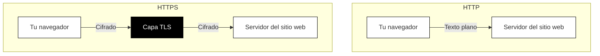

## ¿Qué es HTTPS y TLS?

Probablemente hayas notado que las direcciones de sitios web a veces comienzan con "http://" y a veces con "https://". Esa única letra "s" hace una enorme diferencia para tu seguridad.

### HTTP: la web original, sin protección

HTTP (HyperText Transfer Protocol) es el lenguaje que los navegadores y sitios web usan para comunicarse. Cuando visitas un sitio web, tu navegador envía solicitudes HTTP ("dame esta página") y recibe respuestas HTTP ("aquí está el contenido de la página").

¿El problema? HTTP original envía todo como texto plano. Cualquiera que observe el tráfico de red puede leer cada palabra.

Imagina enviar una postal por correo. Los carteros, las máquinas clasificadoras y cualquiera que maneje la tarjeta puede leer tu mensaje. Eso es HTTP.

### HTTPS: HTTP con una capa segura

HTTPS (HyperText Transfer Protocol Secure) envuelve HTTP dentro de una capa protectora llamada TLS (Transport Layer Security). Tus mensajes aún viajan de la misma manera, pero ahora están cifrados antes de salir de tu dispositivo y descifrados solo cuando llegan al destino.

Si HTTP es una postal, HTTPS es un sobre sellado e inviolable que solo el destinatario puede abrir.

### Qué hace realmente TLS

TLS (Transport Layer Security) realiza tres trabajos críticos:

**1. Cifrado**

TLS cifra todos los datos que fluyen entre tu navegador y el sitio web. Incluso si alguien intercepta tu tráfico, solo ve datos codificados sin sentido.

**2. Autenticación**

TLS verifica que realmente estás hablando con el sitio web que solicitaste. Sin esto, un atacante podría hacerse pasar por tu banco y robar tus credenciales de inicio de sesión. Exploraremos cómo funciona esto en el próximo capítulo.

**3. Integridad**

TLS asegura que los datos no puedan modificarse en tránsito. Si alguien intenta alterar los datos cifrados, el extremo receptor lo detecta y rechaza la conexión.

### Cómo tu navegador establece una conexión segura

Cuando visitas un sitio web HTTPS, ocurre un apretón de manos rápido entre bastidores:

1. **Tu navegador dice hola** y enumera los métodos de cifrado que admite.
2. **El servidor responde** con su certificado TLS y el método de cifrado elegido.
3. **Tu navegador verifica** el certificado (comprobando si es válido y confiable).
4. **Ambas partes acuerdan** las claves de cifrado para esta sesión.
5. **Comienza la comunicación segura.**

Todo este proceso toma una fracción de segundo. Nunca lo notas.

### El icono del candado

Los navegadores modernos muestran un icono de candado (o indicador similar) cuando tienes una conexión HTTPS segura. Este icono significa:

- Tu conexión a este sitio web está cifrada
- El sitio web presentó un certificado TLS válido
- El certificado fue emitido por una autoridad confiable

**Lo que el candado NO significa:**

- El sitio web es legítimo o seguro
- El sitio web no te estafará
- Tu información personal será manejada responsablemente

Un candado confirma que tienes una conexión segura y cifrada a *algún* sitio web. No garantiza que ese sitio web sea confiable. Un sitio de phishing diseñado para robar tu contraseña aún puede tener un candado. Siempre verifica que estás en la dirección correcta del sitio web.

### Cuando HTTPS no está presente

Si visitas un sitio web usando HTTP simple (sin candado, o una advertencia "No seguro"), ten mucho cuidado:

- **Nunca introduzcas contraseñas** en sitios HTTP
- **Nunca introduzcas información de pago** en sitios HTTP
- **No envíes datos sensibles** de ningún tipo

La mayoría de los navegadores modernos te advierten activamente sobre los sitios HTTP, especialmente si contienen formularios de inicio de sesión. Toma en serio estas advertencias.
