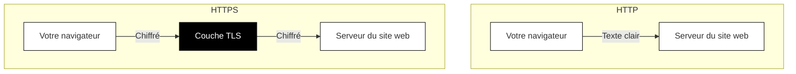

## Qu'est-ce que HTTPS et TLS ?

Vous avez probablement remarqué que les adresses de sites web commencent parfois par « http:// » et parfois par « https:// ». Cette seule lettre « s » fait une énorme différence pour votre sécurité.

### HTTP : le web original, non protégé

HTTP (HyperText Transfer Protocol) est le langage que les navigateurs et les sites web utilisent pour communiquer. Lorsque vous visitez un site web, votre navigateur envoie des requêtes HTTP (« donne-moi cette page ») et reçoit des réponses HTTP (« voici le contenu de la page »).

Le problème ? Le HTTP original envoie tout en texte clair. Quiconque surveille le trafic réseau peut lire chaque mot.

Imaginez envoyer une carte postale par la poste. Les facteurs, les machines de tri et quiconque manipule la carte peut lire votre message. C'est ça HTTP.

### HTTPS : HTTP avec une couche sécurisée

HTTPS (HyperText Transfer Protocol Secure) enveloppe HTTP dans une couche protectrice appelée TLS (Transport Layer Security). Vos messages voyagent toujours de la même manière, mais maintenant ils sont chiffrés avant de quitter votre appareil et déchiffrés uniquement lorsqu'ils atteignent la destination.

Si HTTP est une carte postale, HTTPS est une enveloppe scellée et inviolable que seul le destinataire peut ouvrir.

### Ce que TLS fait réellement

TLS (Transport Layer Security) remplit trois fonctions critiques :

**1. Chiffrement**

TLS chiffre toutes les données qui circulent entre votre navigateur et le site web. Même si quelqu'un intercepte votre trafic, il ne voit que des données brouillées dénuées de sens.

**2. Authentification**

TLS vérifie que vous parlez réellement au site web que vous avez demandé. Sans cela, un attaquant pourrait se faire passer pour votre banque et voler vos identifiants de connexion. Nous explorerons comment cela fonctionne dans le prochain chapitre.

**3. Intégrité**

TLS garantit que les données ne peuvent pas être modifiées en transit. Si quelqu'un tente de falsifier les données chiffrées, le côté receveur le détecte et rejette la connexion.

### Comment votre navigateur établit une connexion sécurisée

Lorsque vous visitez un site web HTTPS, une poignée de main rapide se produit en coulisses :

1. **Votre navigateur dit bonjour** et liste les méthodes de chiffrement qu'il prend en charge.
2. **Le serveur répond** avec son certificat TLS et la méthode de chiffrement choisie.
3. **Votre navigateur vérifie** le certificat (en vérifiant s'il est valide et digne de confiance).
4. **Les deux parties se mettent d'accord** sur des clés de chiffrement pour cette session.
5. **La communication sécurisée commence.**

Ce processus entier prend une fraction de seconde. Vous ne le remarquez jamais.

### L'icône de cadenas

Les navigateurs modernes affichent une icône de cadenas (ou un indicateur similaire) lorsque vous avez une connexion HTTPS sécurisée. Cette icône signifie :

- Votre connexion à ce site web est chiffrée
- Le site web a présenté un certificat TLS valide
- Le certificat a été émis par une autorité de confiance

**Ce que le cadenas ne signifie PAS :**

- Le site web est légitime ou sûr
- Le site web ne vous arnaquera pas
- Vos informations personnelles seront traitées de manière responsable

Un cadenas confirme que vous avez une connexion sécurisée et chiffrée vers *un* site web. Il ne garantit pas que ce site web est digne de confiance. Un site de phishing conçu pour voler votre mot de passe peut toujours avoir un cadenas. Vérifiez toujours que vous êtes sur la bonne adresse de site web.

### Quand HTTPS n'est pas présent

Si vous visitez un site web utilisant le HTTP simple (pas de cadenas, ou un avertissement « Non sécurisé »), soyez très prudent :

- **N'entrez jamais de mots de passe** sur des sites HTTP
- **N'entrez jamais d'informations de paiement** sur des sites HTTP
- **Ne soumettez aucune donnée sensible** de quelque nature que ce soit

La plupart des navigateurs modernes vous avertissent activement des sites HTTP, surtout s'ils contiennent des formulaires de connexion. Prenez ces avertissements au sérieux.
