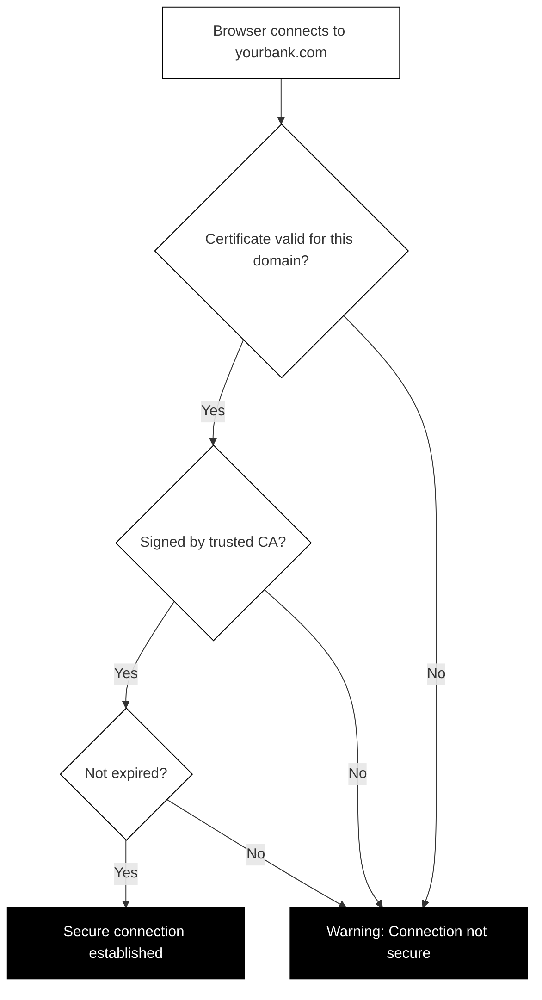

## How TLS certificates work

Encryption alone is not enough. Imagine you want to send a secret message to your bank. You encrypt it perfectly, but what if you accidentally sent it to a criminal pretending to be your bank? The encryption would protect the message in transit, but it would go to the wrong person entirely.

TLS certificates solve this identity problem.

### What is a TLS certificate?

A TLS certificate is a digital identity card for a website. Just like a passport proves your identity in the physical world, a TLS certificate proves a website's identity online.

A certificate contains:

- **The domain name** (or names) the certificate is valid for
- **The public key** that visitors should use for encryption
- **The organization** that owns the website (sometimes)
- **The issuer** who verified and signed the certificate
- **Validity dates** showing when the certificate expires
- **A digital signature** proving the certificate is genuine

When you connect to a website, your browser receives this certificate and checks every detail before establishing a secure connection.

### Certificate Authorities: The trust anchors

Who issues these certificates? Organizations called Certificate Authorities (CAs).

A Certificate Authority is a trusted organization that verifies website identities and issues certificates. Think of them like passport offices: they check your documents before issuing an official passport that others will trust.

Major Certificate Authorities include:

- Let's Encrypt (free, automated certificates)
- DigiCert
- Sectigo
- GlobalSign

Your browser and operating system come pre-loaded with a list of trusted CAs. When a website presents a certificate signed by one of these authorities, your browser trusts it automatically.

### One certificate per domain

Certificates are tied to specific domain names. A certificate for "example.com" cannot be used for "othersite.com." This is crucial for security.

When your browser connects to "yourbank.com," it checks:

1. Did the server present a certificate?
2. Is the certificate valid for "yourbank.com"?
3. Is the certificate signed by a trusted CA?
4. Has the certificate expired?

If any check fails, your browser shows a warning.

### The certificate chain of trust

Most websites do not get their certificates directly from a root CA. Instead, there is a chain:

1. **Root CA**: The ultimate trust anchor. These are extremely protected and rarely used directly.
2. **Intermediate CA**: Authorized by a root CA to issue certificates. Most of your daily certificates come from these.
3. **Website certificate**: The one your bank or favorite site uses.

When you visit a website, your browser follows this chain upward. If it can trace the chain back to a root CA it trusts, the connection is verified.

This chain system exists for security. If an intermediate CA is compromised, it can be revoked without affecting the root. If root CAs signed every website certificate directly, a single compromise could undermine the entire internet's trust system.

### How to check a certificate in your browser

You can examine any website's certificate yourself:

**In Chrome:**
1. Click the padlock icon (or tune icon) in the address bar
2. Click "Connection is secure"
3. Click "Certificate is valid"
4. Browse the certificate details

**In Firefox:**
1. Click the padlock icon
2. Click "Connection secure"
3. Click "More Information"
4. Click "View Certificate"

**In Safari:**
1. Click the padlock icon in the address bar
2. Click "Show Certificate"

When viewing a certificate, you can see:

- **Issued to**: Which domain or organization this certificate belongs to
- **Issued by**: Which CA signed this certificate
- **Valid from/to**: The certificate's active period
- **Fingerprint**: A unique identifier for this specific certificate

Checking certificates is not something you need to do for every website. But if you ever see a security warning, knowing how to investigate can help you understand what is wrong.

### When certificates go wrong

Your browser will warn you if:

- The certificate has expired
- The certificate is for a different domain
- The certificate was signed by an untrusted authority
- The certificate has been revoked

Take these warnings seriously. While occasionally a website admin simply forgot to renew their certificate, these warnings can also indicate an attack. Never enter sensitive information on a site showing certificate errors.
