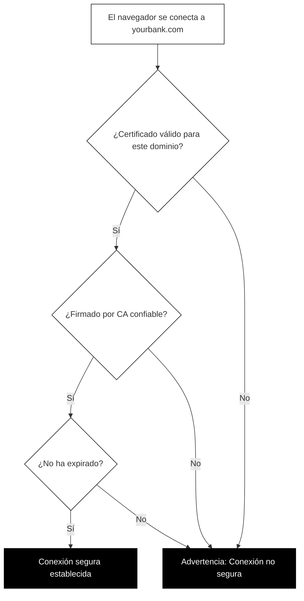

## Cómo funcionan los certificados TLS

El cifrado solo no es suficiente. Imagina que quieres enviar un mensaje secreto a tu banco. Lo cifras perfectamente, pero ¿qué pasa si accidentalmente lo enviaste a un criminal que se hace pasar por tu banco? El cifrado protegería el mensaje en tránsito, pero iría a la persona equivocada por completo.

Los certificados TLS resuelven este problema de identidad.

### ¿Qué es un certificado TLS?

Un certificado TLS es una tarjeta de identidad digital para un sitio web. Así como un pasaporte prueba tu identidad en el mundo físico, un certificado TLS prueba la identidad de un sitio web en línea.

Un certificado contiene:

- **El nombre de dominio** (o nombres) para el cual el certificado es válido
- **La clave pública** que los visitantes deben usar para el cifrado
- **La organización** que posee el sitio web (a veces)
- **El emisor** que verificó y firmó el certificado
- **Fechas de validez** que muestran cuándo expira el certificado
- **Una firma digital** que prueba que el certificado es genuino

Cuando te conectas a un sitio web, tu navegador recibe este certificado y verifica cada detalle antes de establecer una conexión segura.

### Autoridades de certificación: las anclas de confianza

¿Quién emite estos certificados? Organizaciones llamadas autoridades de certificación (CA).

Una autoridad de certificación es una organización confiable que verifica identidades de sitios web y emite certificados. Piensa en ellas como oficinas de pasaportes: verifican tus documentos antes de emitir un pasaporte oficial en el que otros confiarán.

Las principales autoridades de certificación incluyen:

- Let's Encrypt (certificados gratuitos y automatizados)
- DigiCert
- Sectigo
- GlobalSign

Tu navegador y sistema operativo vienen precargados con una lista de CA confiables. Cuando un sitio web presenta un certificado firmado por una de estas autoridades, tu navegador confía en él automáticamente.

### Un certificado por dominio

Los certificados están vinculados a nombres de dominio específicos. Un certificado para "example.com" no puede usarse para "othersite.com". Esto es crucial para la seguridad.

Cuando tu navegador se conecta a "yourbank.com", verifica:

1. ¿Presentó el servidor un certificado?
2. ¿Es el certificado válido para "yourbank.com"?
3. ¿Está el certificado firmado por una CA confiable?
4. ¿Ha expirado el certificado?

Si alguna verificación falla, tu navegador muestra una advertencia.

### La cadena de confianza de certificados

La mayoría de los sitios web no obtienen sus certificados directamente de una CA raíz. En su lugar, hay una cadena:

1. **CA raíz**: El ancla de confianza definitiva. Están extremadamente protegidas y rara vez se usan directamente.
2. **CA intermedia**: Autorizada por una CA raíz para emitir certificados. La mayoría de tus certificados diarios provienen de estas.
3. **Certificado del sitio web**: El que tu banco o sitio favorito usa.

Cuando visitas un sitio web, tu navegador sigue esta cadena hacia arriba. Si puede rastrear la cadena hasta una CA raíz en la que confía, la conexión está verificada.

Este sistema de cadena existe por seguridad. Si una CA intermedia se ve comprometida, puede revocarse sin afectar la raíz. Si las CA raíz firmaran directamente cada certificado de sitio web, una sola compromisión podría socavar todo el sistema de confianza de internet.

### Cómo verificar un certificado en tu navegador

Puedes examinar el certificado de cualquier sitio web tú mismo:

**En Chrome:**
1. Haz clic en el icono de candado (o icono de ajuste) en la barra de direcciones
2. Haz clic en "La conexión es segura"
3. Haz clic en "El certificado es válido"
4. Navega por los detalles del certificado

**En Firefox:**
1. Haz clic en el icono de candado
2. Haz clic en "Conexión segura"
3. Haz clic en "Más información"
4. Haz clic en "Ver certificado"

**En Safari:**
1. Haz clic en el icono de candado en la barra de direcciones
2. Haz clic en "Mostrar certificado"

Al ver un certificado, puedes ver:

- **Emitido para**: A qué dominio u organización pertenece este certificado
- **Emitido por**: Qué CA firmó este certificado
- **Válido desde/hasta**: El período activo del certificado
- **Huella digital**: Un identificador único para este certificado específico

Verificar certificados no es algo que necesites hacer para cada sitio web. Pero si alguna vez ves una advertencia de seguridad, saber cómo investigar puede ayudarte a entender qué está mal.

### Cuando los certificados fallan

Tu navegador te advertirá si:

- El certificado ha expirado
- El certificado es para un dominio diferente
- El certificado fue firmado por una autoridad no confiable
- El certificado ha sido revocado

Toma en serio estas advertencias. Aunque ocasionalmente un administrador de sitio web simplemente olvidó renovar su certificado, estas advertencias también pueden indicar un ataque. Nunca introduzcas información sensible en un sitio que muestre errores de certificado.
