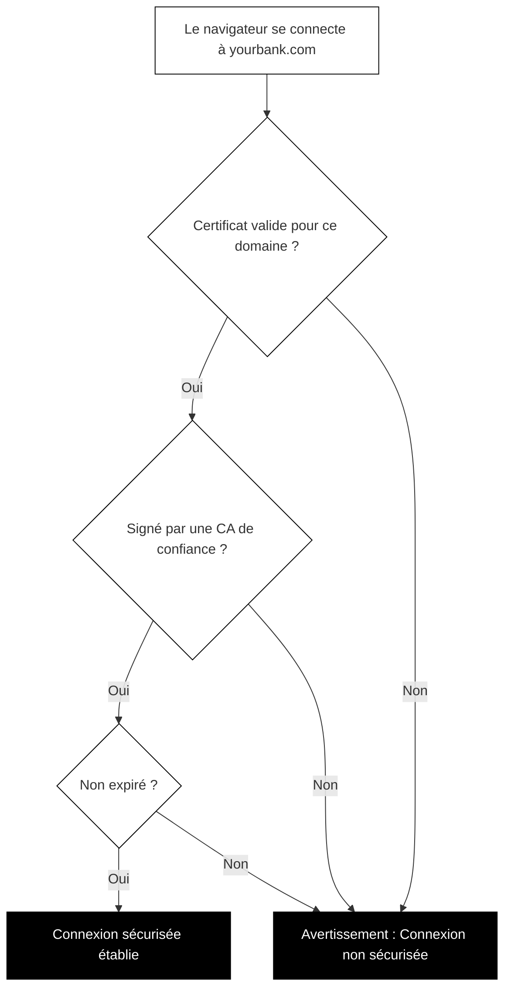

## Comment fonctionnent les certificats TLS

Le chiffrement seul ne suffit pas. Imaginez que vous vouliez envoyer un message secret à votre banque. Vous le chiffrez parfaitement, mais que se passe-t-il si vous l'envoyez accidentellement à un criminel se faisant passer pour votre banque ? Le chiffrement protégerait le message en transit, mais il irait à la mauvaise personne.

Les certificats TLS résolvent ce problème d'identité.

### Qu'est-ce qu'un certificat TLS ?

Un certificat TLS est une carte d'identité numérique pour un site web. Tout comme un passeport prouve votre identité dans le monde physique, un certificat TLS prouve l'identité d'un site web en ligne.

Un certificat contient :

- **Le nom de domaine** (ou les noms) pour lequel le certificat est valide
- **La clé publique** que les visiteurs doivent utiliser pour le chiffrement
- **L'organisation** qui possède le site web (parfois)
- **L'émetteur** qui a vérifié et signé le certificat
- **Les dates de validité** montrant quand le certificat expire
- **Une signature numérique** prouvant que le certificat est authentique

Lorsque vous vous connectez à un site web, votre navigateur reçoit ce certificat et vérifie chaque détail avant d'établir une connexion sécurisée.

### Les autorités de certification : les ancres de confiance

Qui émet ces certificats ? Des organisations appelées autorités de certification (CA).

Une autorité de certification est une organisation de confiance qui vérifie les identités des sites web et émet des certificats. Pensez à elles comme des bureaux de passeports : ils vérifient vos documents avant de délivrer un passeport officiel que d'autres feront confiance.

Les principales autorités de certification incluent :

- Let's Encrypt (certificats gratuits et automatisés)
- DigiCert
- Sectigo
- GlobalSign

Votre navigateur et votre système d'exploitation sont préchargés avec une liste d'autorités de certification de confiance. Lorsqu'un site web présente un certificat signé par l'une de ces autorités, votre navigateur lui fait automatiquement confiance.

### Un certificat par domaine

Les certificats sont liés à des noms de domaine spécifiques. Un certificat pour « example.com » ne peut pas être utilisé pour « othersite.com ». C'est crucial pour la sécurité.

Lorsque votre navigateur se connecte à « yourbank.com », il vérifie :

1. Le serveur a-t-il présenté un certificat ?
2. Le certificat est-il valide pour « yourbank.com » ?
3. Le certificat est-il signé par une CA de confiance ?
4. Le certificat a-t-il expiré ?

Si une vérification échoue, votre navigateur affiche un avertissement.

### La chaîne de confiance des certificats

La plupart des sites web n'obtiennent pas leurs certificats directement d'une CA racine. Au lieu de cela, il y a une chaîne :

1. **CA racine** : L'ancre de confiance ultime. Elles sont extrêmement protégées et rarement utilisées directement.
2. **CA intermédiaire** : Autorisée par une CA racine à émettre des certificats. La plupart de vos certificats quotidiens proviennent de celles-ci.
3. **Certificat du site web** : Celui que votre banque ou votre site favori utilise.

Lorsque vous visitez un site web, votre navigateur suit cette chaîne vers le haut. S'il peut remonter la chaîne jusqu'à une CA racine en laquelle il a confiance, la connexion est vérifiée.

Ce système de chaîne existe pour la sécurité. Si une CA intermédiaire est compromise, elle peut être révoquée sans affecter la racine. Si les CA racines signaient directement chaque certificat de site web, une seule compromission pourrait saper tout le système de confiance d'internet.

### Comment vérifier un certificat dans votre navigateur

Vous pouvez examiner le certificat de n'importe quel site web vous-même :

**Dans Chrome :**
1. Cliquez sur l'icône de cadenas (ou l'icône de réglage) dans la barre d'adresse
2. Cliquez sur « La connexion est sécurisée »
3. Cliquez sur « Le certificat est valide »
4. Parcourez les détails du certificat

**Dans Firefox :**
1. Cliquez sur l'icône de cadenas
2. Cliquez sur « Connexion sécurisée »
3. Cliquez sur « Plus d'informations »
4. Cliquez sur « Voir le certificat »

**Dans Safari :**
1. Cliquez sur l'icône de cadenas dans la barre d'adresse
2. Cliquez sur « Afficher le certificat »

Lorsque vous consultez un certificat, vous pouvez voir :

- **Délivré à** : À quel domaine ou organisation ce certificat appartient
- **Délivré par** : Quelle CA a signé ce certificat
- **Valide du/au** : La période d'activité du certificat
- **Empreinte** : Un identifiant unique pour ce certificat spécifique

Vérifier les certificats n'est pas quelque chose que vous devez faire pour chaque site web. Mais si vous voyez un avertissement de sécurité, savoir comment enquêter peut vous aider à comprendre ce qui ne va pas.

### Quand les certificats posent problème

Votre navigateur vous avertira si :

- Le certificat a expiré
- Le certificat est pour un domaine différent
- Le certificat a été signé par une autorité non fiable
- Le certificat a été révoqué

Prenez ces avertissements au sérieux. Bien qu'occasionnellement un administrateur de site web ait simplement oublié de renouveler son certificat, ces avertissements peuvent aussi indiquer une attaque. N'entrez jamais d'informations sensibles sur un site affichant des erreurs de certificat.
